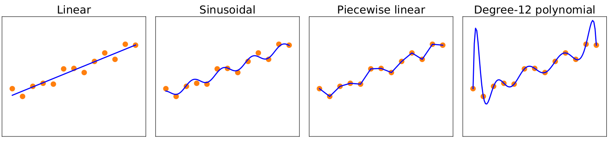
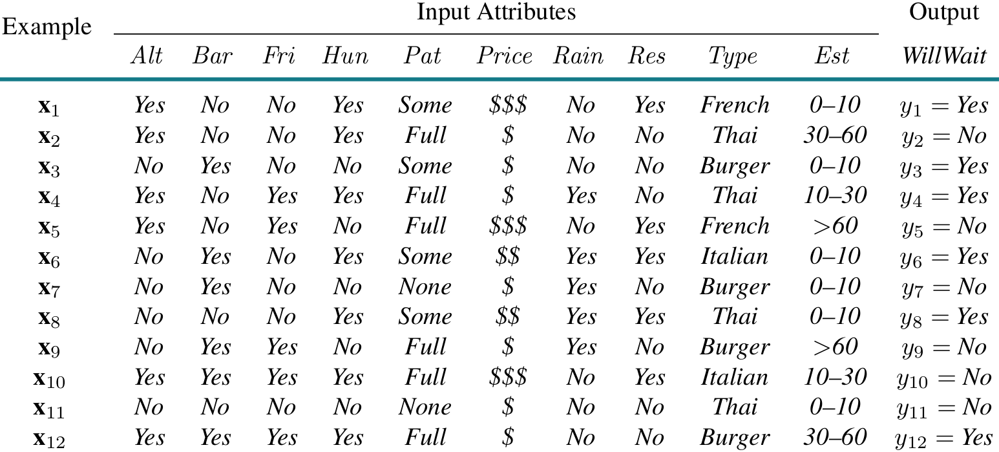
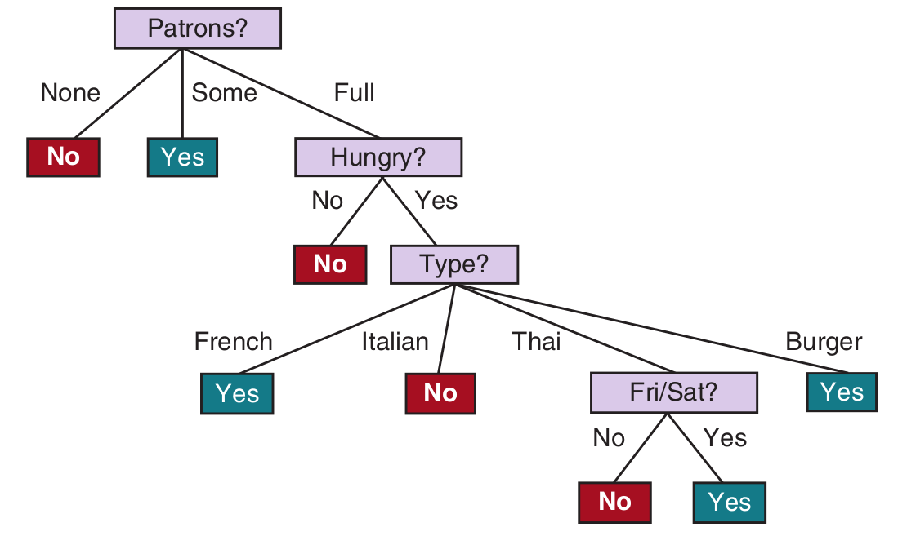
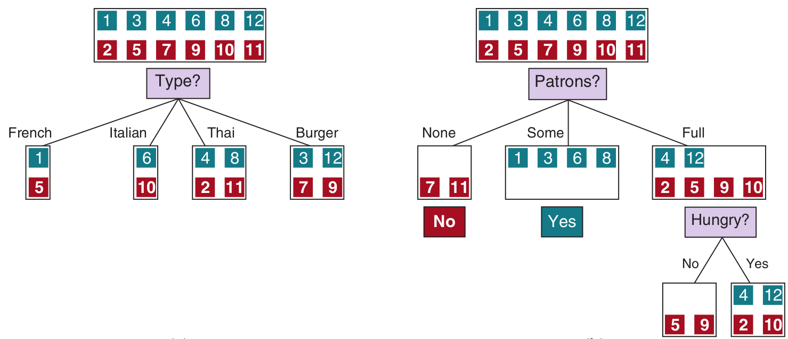

# Learning from Observations

## Forms of learning

### What is a learning agent made of?

#### Performance Element
Deciding what actions to take

#### Learning Element
Modifies the Performance Element so that it makes better decisions

. . .

#### Machine Learning is about designing learning elements

### Issues when designing a learning element

. . .

- _Components_ of the performance element to be learned

  . . .

  - mapping from attributes of current state to actions
  - inferring properties of the world from observed data
  - predicting evolution and results of possible actions
  - inferring desirability of world states
  - inferring desirability of actions
  - inferring states maximizing the agent's utility

. . .

- _Feedback_ available to learn from these components

  . . .

  - supervised, unsupervised, reinforcement

. . .

- _Representation_ to be used for the components

  . . .

  - polynomials for utility functions in game-playing
  - logical sentences for (binary) decision making
  - Bayesian networks for probabilistic estimation
  - Neural networks

## Inductive Learning

### Inductive Learning = Learning from examples

Goal

: Learn an approximation of a _function_ $f$ from _examples_ of $f$

Example

: A pair $(x, f(x))$ where $x$ is the _input_ and $f(x)$ is the value $f$ takes for $x$

Function

: Take a decision, associate a class, predict a quantity, ...

Input

: A tuple of (relevant) information for the problem at hand
: (e.g., color of suit and shoes when choosing a tie)

### The problem of induction

Given a collection of examples of $f$ find a function $h$ (called a _hypothesis_) that approximates $f$

#### Problems
- _Consistency_: does $h$ approximate $f$ well for given examples?
- _Generalization_: does $h$ predict $f$ well for unseen examples?
- _Hypothesis space_: what kind of hypotheses we consider?
- _Selection_: how do we choose between consistent hypotheses?
  - Ockham's razor: select simplest consistent hypothesis
  - How do we define what simple means?

# Learning Decision Trees

### Decision trees

#### What is a decision tree?
- A way to reach a decision by a sequence of tests

{ height=75% }

### Elements of a decision tree

#### Structure of the tree
- _attributes_ as nodes  (e.g., Weather, Time, Hungry)
- attribute values as edges (e.g., Cloudy, <30 mins, No)
- decision values as leafs (Walk, Take Bus)

#### Attributes
Relevant properties of a system (continuous or discrete)

#### Type of decision
- Continuous - regression learning
- Discrete - classification learning

#### Reaching a decision
By Traversing the tree

## Boolean classification using discrete attributes

### Boolean classification using discrete attributes

#### Restrictions

- Finiteness of attribute values
  - branching options for each attribute are known apriori
- Boolean classification
  - decide whether to take an action or not

#### Examples
- provide a value for each attribute
- provide the decision taken for that set of attribute values

### From Decision Trees to Logical formulas

- Associate a name to each attribute value (edge in the tree)
  - Sun := Weather is sunny, NotHungry := I'm not hungry, Short := Walk time is less than 30 mins
- Conjunct variables on paths leading to Positive leafs
  - `Sun /\ Long`, `Cloud /\ Hungry`
- Take disjunction of all such conjunctions
  - `Walk <-> (Sun /\ Long) \/ (Cloud /\ Hungry)`

{ height=50% }

### Expressiveness of Boolean classification

#### Very expressive
Can _realize_ any formula in propositional logic

#### However, ...

- Some problems would require too large (exponential size) trees
  - e.g., parity function, majority function

- Cannot use tests relating multiple states
  - e.g., Is a hungry colleague walking in the same direction
  - although sometimes we can use extra attributes

## Learning decision trees from examples

### Training set

#### Example: (input, f(input))

- Input: A _vector_ $X$ associating values to each considered attribute
- Output: A boolean value $y$ (the decision)

#### Training set
- A set of examples $(X_1, y_1), ..., (X_n, y_n)$

### Problems

#### Finding the best (smallest) tree
- We can always build a tree which is a consistent hypothesis
  - Just draw a tree with a path to a leaf for each example
  - However, that won't be very useful
- The best tree would _generalize_
  - ordering attributes by importance
  - eliminating irrelevant attributes
- In general it's too expensive to find _the smallest_
- However, we can find a _small enough_ one with reasonable effort

### Desirable outcome

{height=40%} \

{height=50%}

### Classification algorithm

#### Input: (a set of examples, a set of attributes, a default decision value)

#### Algorithm
- let _majorityValue_ be the majority decision value for the examples

. . .

- Main loop
  - _Choose an attribute_ as the root of the tree
  - for each value of chosen attribute, repeat algorithm with 
    - examples having that value for the attribute
    - the remaining attributes
    - _majorityValue_ as the default decision value

. . .

- Exit conditions
  - if no more examples, yield a leaf with default value
  - if all examples have same classification, yield a leaf with that
  - If no more attributes, yield a leaf with _majorityValue_

### Choosing the best attribute

- Choose attributes which best discriminate Positive and Negative examples
- Patrons is a good choice (discriminates 6 examples)
- Type is a bad choice (does not seem to separate positive from negative)
- Hungry is a good choice (discriminates 2 examples)

### Choosing the best attribute (Entropy method)

- Shannon's information theory
$$I(P_1, \ldots, P_n) = \sum_{i = 1}^n -P_i*\mathrm{log}_2 P_i$$

- How much information is contained in a correct answer?
$$I(\frac{p}{p + n}, \frac{n}{p + n})$$
  
- How much information will still be needed after choice
$$\mathit{Remainder}(A) = \sum_{i = 1}^v \frac{p_i + n_i}{p + n} *I(\frac{p_i}{p_i + n_i}, \frac{n_i}{p_i + n_i})$$

- How much do we gain by choosing an attribute
$$\mathit{Gain}(A) = I(\frac{p}{p + n}, \frac{n}{p + n}) - \mathit{Remainder}(A)$$

### Choosing the best attribute (Gini Impurity method)

__Gini impurity__: 
Probability of incorrectly classifying a randomly chosen element if randomly labeled according to the class distribution.
$$ G(P_1, \ldots, P_n) = \sum_{i = 1}^n P_i*(1 - P_i) $$

- The impurity of the original set of examples
$$G(\frac{p}{p + n}, \frac{n}{p + n}) = 2 * \frac{p}{p + n} * \frac{n}{p + n}$$

- The weighted impurity of the sets obtained after choice
$$\mathit{Remainder}(A) = \sum_{i = 1}^v \frac{p_i + n_i}{p + n} *G(\frac{p_i}{p_i + n_i}, \frac{n_i}{p_i + n_i})$$

- The Gini Gain
$$\mathit{Gain}(A) = G(\frac{p}{p + n}, \frac{n}{p + n}) - \mathit{Remainder}(A)$$

### Images on the slides

- Decision tree example
  + [http://www.niser.ac.in/~smishra/teach/cs460/lectures/lec11/](http://www.niser.ac.in/~smishra/teach/cs460/lectures/lec11/)
- All other pictures / tables
  + [http://aima.cs.berkeley.edu/](http://aima.cs.berkeley.edu/)