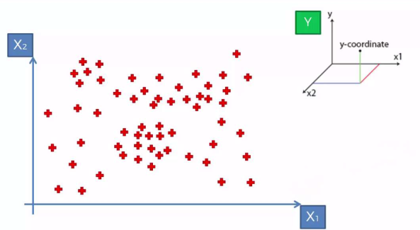
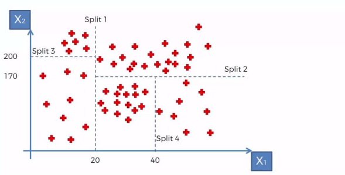
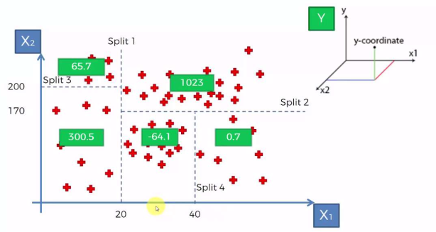
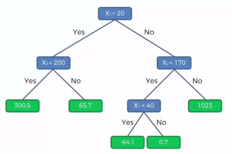

# Regression

### Inductive Learning = Learning from examples

Goal

: Learn an approximation of a _function_ $f$ from _examples_ of $f$

Example

: A pair $(x, f(x))$ where $x$ is the _input_ and $f(x)$ is the value $f$ takes for $x$, called the _output_ of the example

Function

: Take a decision, associate a class, predict a quantity, ...

Input

: A tuple of (relevant) information for the problem at hand
: (e.g., color of suit and shoes when choosing a tie)

### Ingredients for regression

- Approximation model: $y_i = f(x_i) + E_i$
  
  where $f$ is a function and $E_i$ represents the noise (random error)

- The _total squared error_ associated to a set of examples is:
  
  $$\sum_{i=1}^n E_i^2 = \sum_{i=1}^n (y_i - f(x_i))^2$$

- $f$ can _predict_ a value for y for any given _input_ values for x

  - with some (hopefully low) error

  - $x$ are called the _independent variables_ 
  - $y$ is called the _dependent_ variable

### Examples of f(x)

lines
: $y = ax + b + E$

polynomials
: $y = ax^2 + bx + c + E$

other
: $y = a/x + b + E$
: $y = a \mathop{sin}(x) + b + E$

# Linear regression

### Simple linear regression: find the best fitting line

Problem
: Fit a line to the data $y_i = ax_i + b + E_i$

Goal
: find the values for $a$ and $b$ the give the _best fitting_ line

Best fit
: minimizing the total squared error

Total squared error
: $\sum_{i=1}^n E_i^2 = \sum_{i=1}^n (y_i - ax_i - b)^2$

###  Important assumption

* The error is spread uniformly around regression line (Homoscedasticity)

{width=49%}
{width=49%}

### Solving simple linear regression

#### Problem
Fit a line to the data $y_i = ax_i + b + E_i$

#### Solution
$$a = \frac{S_{xy}}{S_{xx}} \mbox{ and }b = \overline y - a\overline x$$

Where

- $\overline x$ is the mean of inputs: $\overline x = \frac{1}{n}\sum x_i$

- $\overline y$ is the mean of outputs: $\overline y = \frac{1}{n}\sum y_i$

- $S_{xx}$ is the unbiased sample variance of $x$: $S_{xx} = \frac{1}{n-1}\sum (x_i - \overline x)^2$

- $S_{xy}$ is the sample covariance of $x$ and $y$: $S_{xy} = \frac{1}{n-1}\sum (x_i - \overline x)(y_i - \overline y)$

### Linear Regression Algorithms (sclearn.linear_model)

#### Classical

LinearRegression
: Basic least squares (multivariate) linear regression

Ridge (regression)
: $L2$ regularization
: Error: $\sum_{i=1}^n (y_i - ax_i - b)^2 + \lambda(a^2 + b^2)$
: good to avoid over-fitting

#### With additional variable selections features

Lasso (regression)
: Least Absolute Shrinkage and Selection Operator (L1 regularization)
: Error: $\sum_{i=1}^n (y_i - ax_i - b)^2 + \lambda(a^2 + b^2)$

ElasticNet
: Combination of L1 and L2 regularization

#  Regression with Decision Trees

### DecisionTreeRegresssor (intuition)

{height=70%}

### DecisionTreeRegresssor (intuition)

{height=70%}

### DecisionTreeRegresssor (intuition)

{height=70%}

### DecisionTreeRegresssor (intuition)

{height=70%}

### Links inspiring this lecture

* [https://www.kaggle.com/sudhirnl7/linear-regression-tutorial](https://www.kaggle.com/sudhirnl7/linear-regression-tutorial)

* [https://ocw.mit.edu/courses/mathematics/18-05-introduction-to-probability-and-statistics-spring-2014/class-slides/MIT18_05S14_class25slides.pdf](https://ocw.mit.edu/courses/mathematics/18-05-introduction-to-probability-and-statistics-spring-2014/class-slides/MIT18_05S14_class25slides.pdf)

* [https://www.slideshare.net/akhileshjoshi123/decision-tree-regression](https://www.slideshare.net/akhileshjoshi123/decision-tree-regression)