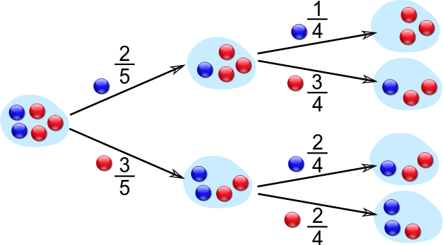

# Conditional Probabilities

## Probability: how __likely__ something is to happen.

$$ \mbox{Probability of an event happening} = \frac{\mbox{Number of ways it can happen}}{\mbox{Total number of outcomes}} $$

### Examples

- In a coin toss there are two possible outcomes: head, or tail

  P(head) = 1/2 = 0.5 = 50%

- Trowing a die there are 6 possible outcomes

  P(3) = 1/6 = 16.67%

- Trowing two dice there are 36 possible outcomes

  P(4) = 3/ 36 = 1 / 12 = 8.33%

- removing a marble from a bag with 3 red marbles and 2 blue

  there are 5 possible outcomes

  P(red) = 3/5 = 60%

## Conditional Probability

The _conditional probability of A given B_ is the probability of A occurring, given that B has already occurred.

## Independent events

_Independent_ events do not affect the outcome of each other. 

### Examples

- A: "first coin toss is head"; B: "second coin toss is head";
- A: "it's X's birthday"; B: "It's Y's birthday"
- A: "Today is raining"; B: "Today I'm brushing my teeth"

### Probability of both happening is the product of probabilities

$$ P(A \cap B) = P(A) \cdot P(B) $$

### Probability of B conditioned by A is the same as if not conditioned

$$ P(B | A)  = \frac{P(A \cap B)}{P(A)} = \frac{P(A) \cdot P(B)}{P(A)}  = P(B)$$

## Dependent events

Events are _dependent_ if the probability of one occurring affects the probability of the other occurring.

### Examples

- I have a bag with 3 red marbles and 2 blue marbles

  A: "first, I remove a blue marble"; B: "next, I remove a blue marble"

  . . .

  $$ P(A \cap B) = \frac{1}{10}\ \ P(B|A) =  \frac{P(A \cap B)}{P(A)} = \frac{\frac{1}{10}}{\frac{2}{5}} = \frac{1}{4}$$\

  A: "first, I remove a blue marble"; B: "next, I remove a red marble"

  . . .

  $$ P(A \cap B) = \frac{3}{10}\ \ P(B|A) =  \frac{P(A \cap B)}{P(A)} = \frac{\frac{3}{10}}{\frac{2}{5}} = \frac{3}{4}$$

- A: "a person smokes"; B: "a person has a heart condition"

## Choosing two marbles from a bag (in order)

\ 

## Odds: how __likely__ something is to happen.

$$ \mbox{The odds of an event happening} = \frac{\mbox{Number of ways it can happen}}{\mbox{Number of ways it doesn't happen}} $$

### Examples

- In a coin toss there are two possible outcomes: head, or tail

  Odds head = 1:1

- Trowing a die there are 6 possible outcomes

  Odds 3 = 1:5

- Trowing two dice there are 36 possible outcomes

  Odds 4 = 3:33 = 1 : 11

- removing a marble from a bag with 3 red marbles and 2 blue

  there are 5 possible outcomes

  odds red = 3:2

## Relation between odds and probability

$$ \mbox{Probability of an event happening} = \frac{\mbox{Number of ways it can happen}}{\mbox{Total number of outcomes}} $$

$$ \mbox{The odds of an event happening} = \frac{\mbox{Number of ways it can happen}}{\mbox{Number of ways it doesn't happen}} $$

- If _NA_ is numbers of ways _A_ can happen and _N_ is total number of outcomes, then number of ways _A_ doesn't happen is _N - NA_

  $$ P(A) = \frac{NA}{N} \hspace{5em} P(\mathop{not}
   A) = \frac{N-NA}{N} = 1 - \frac{NA}{N} = 1 - P(A)$$

  $$ \mathop{odds} A = \frac{NA}{N-NA} = \frac{\frac{NA}{N}}{\frac{N - NA}{N}} = \frac{P(A)}{P(\mathop{not} A)} = \frac{P(A)}{1 - P(A)} $$

## References

- [Mithun Manohar (2018). Machine Learning 101: What is a conditional probability. on Medium](https://mithunmanohar.medium.com/machine-learning-101-what-the-is-a-conditional-probability-f0f9a9ec6cda)

- [J00n (2020). Logistic Regression 101 — Basics. on Medium](https://medium.com/@jsy9/logistic-regression-101-2c5617429e01)

- [MATHisFUN. Probability](https://www.mathsisfun.com/data/probability.html)

- [MATHisFUN. Conditional Probability](https://www.mathsisfun.com/data/probability-events-conditional.html)